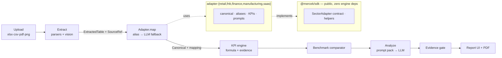

# Mercek

> **Sector-aware AI analyst — five domain experts, one framework.**
> Raw operational data (Excel / CSV / PDF / screenshot) read the way a domain
> specialist would read it: insight, benchmark comparison, action — with every
> number traceable to its source cell.

_“Ham veri, uzman gözü.”_

Not “AI reads your spreadsheet.” A retail analyst and a manufacturing engineer
do not think alike. Mercek encodes that difference as code: **five sector
adapters behind one engine.** Adding a sector is one file + one registry line.

## Why it's different

- **Every number traces to its source.** Each KPI carries its formula and the
  cell range that produced it. The UI cannot render a number without provenance.
- **It flags gaps, it doesn't fabricate.** No cost column → the margin KPI is
  `unavailable` with a reason; the analysis prompt is told what's missing so the
  model doesn't hallucinate around it. An evidence-validation gate flags any
  finding that cites a number outside the computed KPI set.
- **Honest data.** Sample datasets are fully synthetic and labelled; benchmarks
  cite their source (or say `Synthetic`).

## The five sectors — each with a signature move

| Sector | Signature | Live eval |
|---|---|---|
| **Retail** | Pareto + return-anomaly + quietly-declining category | AI finds 3/3 |
| **F&B** | Menu-engineering matrix (Star/Plowhorse/Puzzle/Dog) | AI finds 3/3 |
| **Finance** | **TÜFE real-return engine** (nominal growth deflated by CPI) | AI finds 3/3 |
| **Manufacturing** | **OEE = A×P×Q** + names the binding constraint | AI finds 3/3 |
| **SaaS** | **Quick Ratio** exposes the leaky bucket | AI finds 3/3 |

Each sector ships a synthetic fixture with **planted problems and an answer
key**; a live-LLM eval scores whether the analysis surfaces them. All five pass
3/3 against live Gemini.

## Architecture



**Package boundary rule:** `@mercek/sdk` has **zero** dependency on
`@mercek/core` — an external contributor can `npm i @mercek/sdk` and write an
adapter without pulling the engine (enforced in CI).

```
apps/web            Next.js 16 — landing · /vaka case studies · /benchmark · /analyze · /r/[id] report
packages/sdk        PUBLIC adapter contract (§8) + helpers (alias matcher, locale number parser)
packages/core       Engine: ingest · extract (+vision) · KPI runner · benchmark · LLM router · analyze
packages/adapter-*  The five sectors (each sdk-only)
packages/db         Prisma 7 + Postgres/pgvector (§6 data model)
packages/ui         Shared UI + cn()
fixtures/           Synthetic datasets + answer keys per sector
docs/adapter-guide.md   "Write your own sector in ~200 lines"
```

## Stack

Next.js 16 · tRPC v11 · Tailwind v4 · Prisma 7 + Postgres/pgvector · Better Auth
· Vercel AI SDK (Google Gemini) · Recharts · Turborepo + pnpm · TypeScript 5.9
(strict).

## Develop

```bash
pnpm install
pnpm --filter @mercek/db db:generate          # generate Prisma client
cp .env.example .env                           # fill DATABASE_URL, GOOGLE_API_KEY_DEV
pnpm --filter @mercek/db db:deploy             # apply migration (Neon/Postgres + pgvector)
pnpm --filter @mercek/web seed:fixture         # pre-compute the 5 demo reports
pnpm dev                                        # http://localhost:3000
```

Run a sector's live eval: `pnpm --filter @mercek/adapter-retail eval`.
Checks: `pnpm typecheck && pnpm lint && pnpm test && pnpm check:sdk`.

## Write your own sector

See **[docs/adapter-guide.md](docs/adapter-guide.md)** — implement
`SectorAdapter<TCanonical>` against `@mercek/sdk` (types + pure helpers, no
engine), then one `registerAdapter` line. If it costs more than that, the
abstraction leaked.

---

_Portfolio demo. All sample data is synthetic and labelled as such._
