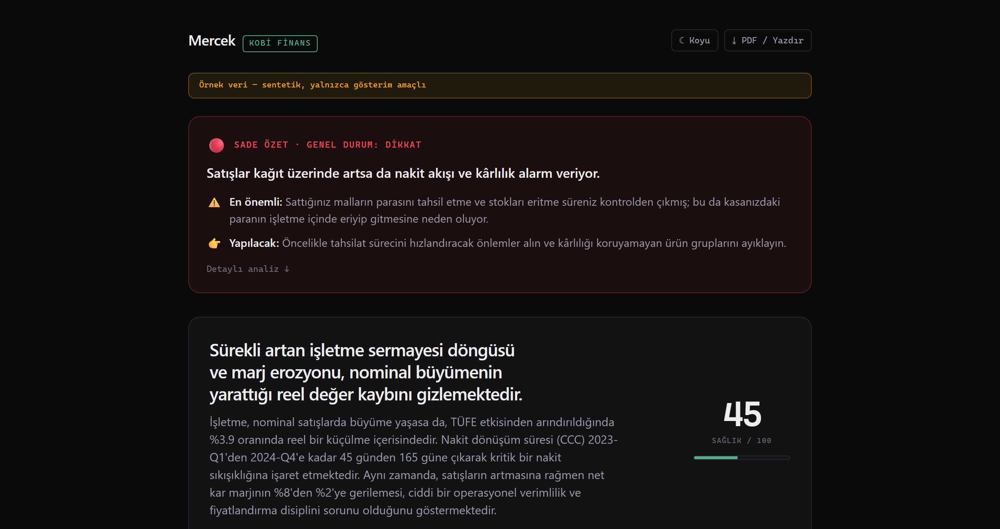
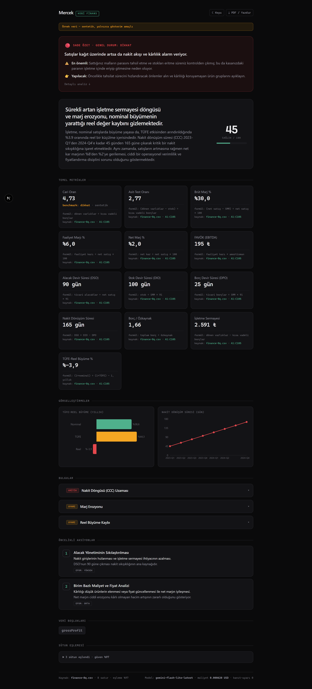
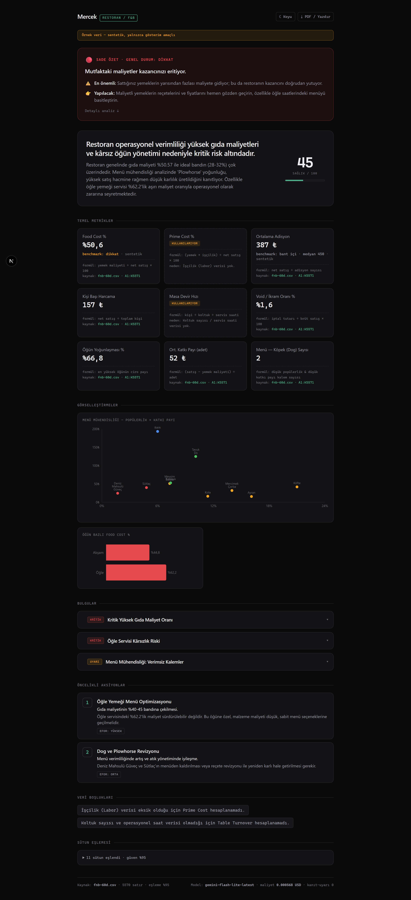
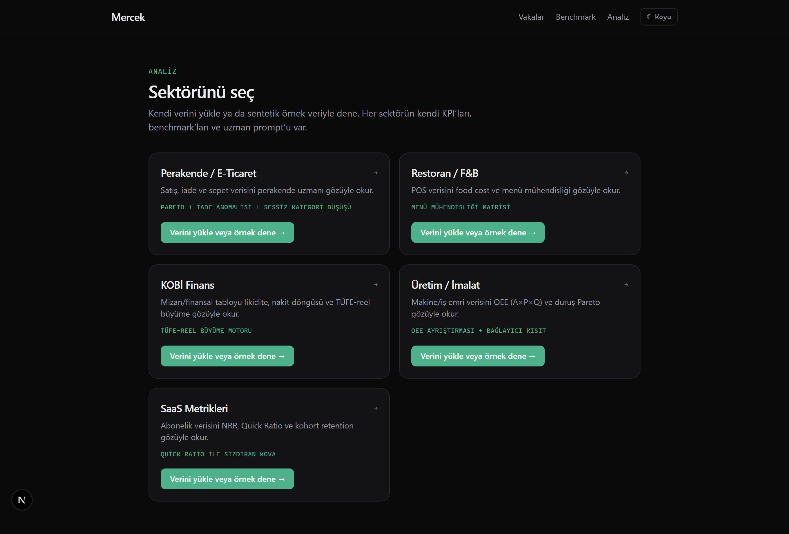
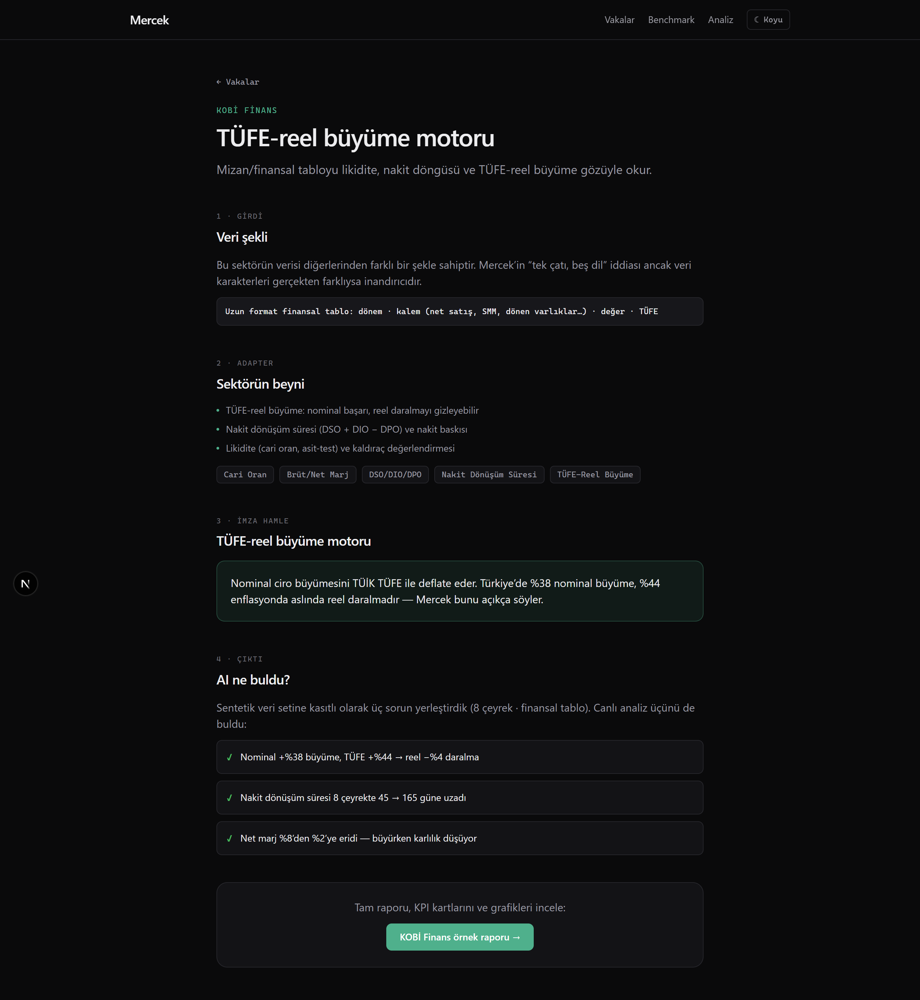
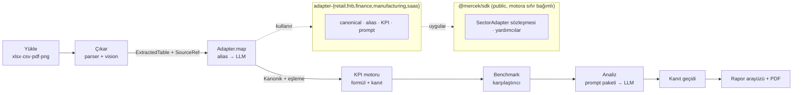

<div align="center">

# Mercek

**Sektöre duyarlı AI analist: beş sektör uzmanı, tek çatı.**

Ham operasyon verinizi (Excel, CSV, PDF, ekran görüntüsü), o sektörün diline
hâkim bir uzmanın gözüyle okur. Size içgörü, benchmark karşılaştırması ve aksiyon
önerisi sunar; üstelik ürettiği her sayı, kaynak hücresine kadar izlenebilir.

_“Ham veri, uzman gözü.”_

<br/>



</div>

---

## Ekran görüntüleri

| Rapor (Finans) | Menü mühendisliği (F&B) |
|---|---|
|  |  |
| **Sektör seçimi** | **Vaka çalışması** |
|  |  |

Her rapor, teknik olmayan biri için hazırlanan **Sade Özet** paneliyle başlar
(trafik ışığı ve jargonsuz özet). Panelin altında; formül ve kaynak hücresi
taşıyan KPI kartları, bulgular, aksiyonlar ve sektöre özel grafikler yer alır.

## Hemen dene

- Uygulamada `Analize başla → sektör → Örnek veriyle dene` yolunu izleyerek
  önceden hesaplanmış ücretsiz raporları görebilirsiniz.
- Dilerseniz kendi Excel dosyanızı da yükleyebilirsiniz. `ornek-veriler/`
  klasöründe her sektör için analiz edilebilir örnek `.xlsx` dosyaları bulunur
  (bu dosyalar sektör sayfasından da indirilebilir).

## Mercek nedir?

“Yapay zekâ tablonuzu okur” demek yeterli değil. Bir perakendeci ile bir üretim
mühendisi aynı biçimde düşünmez; Mercek bu farkı **kod olarak** taşır. Tek bir
motorun arkasında **beş ayrı sektör beyni** çalışır. Yeni bir sektör eklemek, bir
dosya ve tek satırlık bir kayıttan ibarettir.

Genel amaçlı AI araçları sektörden habersizdir; food cost’un ne olduğunu, OEE’yi
ya da kohort retention’ı kavrayamazlar. Mercek’i ayıran şey, her sektör için
hazırlanmış gerçek KPI sözlüğü, benchmark verisi, prompt paketi ve analiz
şablonudur.

## Ne işe yarar?

Çoğu küçük ve orta ölçekli işletme, elindeki satış, üretim ya da finans
verisinden anlamlı bir sonuç çıkaramaz; bunun için de pahalı bir danışmana veya
tam zamanlı bir analiste ihtiyaç duyar. Mercek bu boşluğu doldurmayı hedefler:
elinizdeki ham tabloyu yüklersiniz, karşılığında sektörünüze özgü bir
değerlendirme alırsınız.

Tipik kullanım senaryoları şunlardır:

- **Dönemsel performans değerlendirmesi:** Hangi kategori büyüyor, hangisi
  sessizce daralıyor?
- **Sorun tespiti:** Yüksek iade oranı, düşük kârlılık ya da gizli bir üretim
  darboğazı nerede?
- **Kârlılık ve nakit takibi:** Nominal büyüme enflasyon karşısında gerçekten
  değer üretiyor mu, nakit döngüsü uzuyor mu?
- **Önceliklendirme:** Sınırlı zamanınızı hangi aksiyona ayırmalısınız?

Genel amaçlı bir sohbet aracına tablo yapıştırmaktan temel farkı şudur: Mercek
sektör bağlamını bilir ve **hiçbir sayıyı uydurmaz**. Veri eksikse bunu açıkça
söyler, olmayan bir sonucu icat etmez.

## Neden farklı?

- **Her sayı kaynağına iner.** Her KPI, kendi formülünü ve onu üreten hücre
  aralığını taşır. Arayüz, kaynağı olmayan bir sayıyı ekrana **getiremez**.
  “CSV’yi sohbete yapıştır” yaklaşımından onu ayıran şey de budur.
- **Uydurmaz, işaret eder.** Maliyet sütunu yoksa brüt marjı uydurmaz;
  `kullanılamıyor` der ve bu eksikliği analiz prompt’una bildirir. Bir **kanıt
  doğrulama geçidi**, hesaplanan KPI setinde bulunmayan bir sayıya dayanan her
  bulguyu işaretler.
- **Dürüst veri.** Örnek veriler tamamen sentetiktir ve açıkça etiketlenmiştir;
  benchmark’lar ya kaynağını belirtir ya da `Sentetik` olduğunu söyler. Bu
  kısıtlar, tip sistemi tarafından zorunlu kılınır.

## Beş sektör, her biri bir imza hamlesiyle

| Sektör | İmza hamle | Canlı eval |
|---|---|---|
| **Perakende** | Pareto + iade anomalisi + sessizce daralan kategori | AI 3/3 buldu |
| **Restoran / F&B** | Menü mühendisliği matrisi (Yıldız / Beygir / Bilmece / Köpek) | AI 3/3 buldu |
| **KOBİ Finans** | **TÜFE-reel büyüme motoru** (nominal büyüme enflasyonla düzeltilir) | AI 3/3 buldu |
| **Üretim / İmalat** | **OEE = A×P×Q** + bağlayıcı kısıtı isimlendirir | AI 3/3 buldu |
| **SaaS Metrikleri** | **Quick Ratio** ile sızdıran kovayı ifşa eder | AI 3/3 buldu |

Her sektör; içine **kasıtlı sorunlar ve bir cevap anahtarı** yerleştirilmiş
sentetik bir veri seti ile gelir. Canlı LLM eval’i, analizin bu sorunları bulup
bulamadığını puanlar. **Beş sektörün tümü, canlı Gemini ile 3/3 geçer** (toplam
15 gizli sorunun 15’i bulundu, analiz başına yaklaşık $0,0005 maliyet).

## Nasıl çalışır?

```
Yükle → Çıkar → Eşle → Hesapla → Analiz → Rapor
```

1. **Yükle:** Excel, CSV, PDF veya ekran görüntüsü.
2. **Çıkar:** Deterministik parser’lar ya da Gemini vision devreye girer; her
   tablo bir `SourceRef` (kaynak referansı) taşır ve bu referans rapora kadar
   korunur.
3. **Eşle:** Sektör adapteri, dağınık başlıkları kanonik alanlara bağlar (önce
   alias/fuzzy eşleştirme, gerekirse LLM).
4. **Hesapla:** KPI motoru formül ve kanıtla çalışır; eksik bir alan, ilgili
   KPI’yı temizce `kullanılamıyor` durumuna düşürür, sistemi asla çökertmez.
5. **Analiz:** Sektörün prompt paketiyle (persona, alan bilgisi ve yöntem)
   yapılandırılmış içgörü üretilir; kanıt geçidi halüsinasyonu yakalar.
6. **Rapor:** İçgörü, aksiyon, grafikler ve PDF; sağlık skoru ve veri
   boşluklarıyla birlikte sunulur.

## Mimari



**Paket sınırı kuralı:** `@mercek/sdk`, `@mercek/core`’a **sıfır** bağımlıdır.
Dışarıdan bir katkı sağlayıcı, `npm i @mercek/sdk` yapıp motoru hiç çekmeden
adapter yazabilir. Bu kural, CI tarafından denetlenir.

## Proje yapısı

```
apps/web            Next.js 16: landing · /vaka (vakalar) · /benchmark · /analyze · /r/[id] (rapor)
packages/sdk        PUBLIC adapter sözleşmesi + yardımcılar (alias eşleştirici, locale sayı parser'ı)
packages/core       Motor: ingest · extract (+vision) · KPI runner · benchmark · LLM router · analiz
packages/adapter-*  Beş sektör (her biri yalnız sdk'ya bağımlı)
packages/db         Prisma 7 + Postgres/pgvector (§6 veri modeli)
packages/ui         Paylaşımlı arayüz + cn()
fixtures/           Sektör başına sentetik veri seti + cevap anahtarı
docs/adapter-guide.md   "Kendi sektörünü ~200 satırda yaz"
docker-compose.yml  Üretim veritabanı (Postgres 16 + pgvector), VDS dağıtımı için
```

## Teknoloji

| Katman | Seçim |
|---|---|
| Framework / API | Next.js 16 (App Router) + tRPC v11 |
| Arayüz | Tailwind v4 · Recharts |
| Veritabanı | PostgreSQL + `pgvector` · Prisma 7 (driver adapter) |
| Kimlik | Better Auth (magic link) |
| LLM | Vercel AI SDK + Google Gemini |
| Doğrulama | Zod (tRPC + yapılandırılmış çıktı ortak) |
| Rate limit | Upstash Redis |
| Monorepo | Turborepo + pnpm · TypeScript 5.9 (strict) |

## Kurulum ve çalıştırma

Gereksinim: Node ≥ 22, pnpm 11 ve bir Postgres bağlantısı (yerel Docker istemez;
[Neon](https://neon.com) gibi bulut Postgres yeterlidir).

```bash
pnpm install
pnpm --filter @mercek/db db:generate          # Prisma client üret
cp .env.example .env                           # DATABASE_URL, GOOGLE_API_KEY_DEV doldur
pnpm --filter @mercek/db db:deploy             # migration'ı uygula (Postgres + pgvector)
pnpm --filter @mercek/web seed:fixture         # 5 demo raporunu önceden hesapla
pnpm dev                                        # http://localhost:3000
```

Ortam değişkenlerinin tamamı için `.env.example` dosyasına bakın. Gizli anahtarlar
`.env` dosyalarında tutulur ve git’e **gönderilmez**.

## Testler ve eval

```bash
pnpm typecheck && pnpm lint && pnpm test        # tüm paketler
pnpm check:sdk                                  # SDK'nın motora bağımsızlığını denetle
pnpm --filter @mercek/adapter-retail eval       # canlı LLM eval (bir sektör)
```

**Eval en değerli test varlığıdır.** Her fixture bir cevap anahtarı taşır; eval,
analizin yerleştirilmiş sorunları bulup bulmadığını ölçer ve prompt her
değiştiğinde çalıştırılır. Evaller, para/maliyet ve determinizm nedeniyle CI
dışında, yalnızca istendiğinde koşar.

## Kendi sektörünü ekle

Ayrıntılar için **[docs/adapter-guide.md](docs/adapter-guide.md)** rehberine
bakın. Yalnızca `@mercek/sdk`’ya (tipler ve saf yardımcılar; motor yok) dayanarak
`SectorAdapter<TCanonical>` arayüzünü uygularsınız, ardından tek satırlık bir
`registerAdapter` çağrısı eklersiniz. Bir sektör eklemek bundan fazla emek
gerektiriyorsa, soyutlama sızıyor demektir.

## Durum ve yol haritası

**Tamamlandı (S0-S8):** monorepo temeli · veri alma/çıkarım (vision ve locale
sayı parser’ı) · adapter sözleşmesi ve KPI motoru · LLM katmanı (router, maliyet
takibi, kanıt geçidi, rate limit) · beş sektör adapteri (evaller 3/3) · rapor
arayüzü ve PDF · landing, vaka ve benchmark sayfaları.

**Bu bir demodur ve geliştirilmeye açıktır.** Mercek, bir portfolyo projesi
olarak tasarlandı. Çekirdek analiz motoru ve beş sektör uçtan uca çalışır
durumdadır; ancak proje henüz üretim ölçeğinde bitmiş bir ürün değildir ve tüm
örnek veriler sentetiktir. İleride eklenmeye aday başlıklar şunlardır:

- Daha fazla sektör adapteri (aynı sözleşmeyle).
- Gerçek dosya depolama (Cloudflare R2) ve kalıcı rapor geçmişi.
- Çoklu LLM sağlayıcı ve benchmark sayfasında sağlayıcılar arası karşılaştırma.
- Kullanıcı hesapları ve kayıtlı çalışma alanları.
- Üretim dağıtımı (`docker-compose.yml` bir VDS için hazırdır).
- Video anlatımlar.

---

<div align="center">

**“Ham veri, uzman gözü.”** · Portfolyo demosu · Tüm örnek veriler sentetiktir.

</div>
