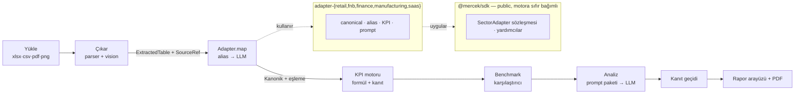

<div align="center">

# Mercek

**Sektör-farkında AI analist — beş sektör uzmanı, tek çatı.**

Ham operasyon verisini (Excel · CSV · PDF · ekran görüntüsü), o sektörün diline
hâkim bir uzmanın gözüyle okur: içgörü, benchmark karşılaştırması ve aksiyon —
üstelik **her sayı kaynak hücresine kadar izlenebilir.**

_“Ham veri, uzman gözü.”_

</div>

---

## Mercek nedir?

“Yapay zekâ tablonu okur” değil. Bir perakendeci ile bir üretim mühendisi aynı
düşünmez; Mercek bu farkı **kod olarak** taşır: tek bir motorun arkasında **beş
ayrı sektör beyni.** Yeni bir sektör eklemek = bir dosya + bir satır kayıt.

Generic AI araçları sektörden habersizdir — food cost’un ne olduğunu, OEE’yi ya
da kohort retention’ı kavramazlar. Mercek’in farkı, her sektör için gerçek KPI
sözlüğü, benchmark verisi, prompt paketi ve analiz şablonudur.

## Neden farklı?

- **Her sayı kaynağına iner.** Her KPI kendi formülünü ve onu üreten hücre
  aralığını taşır. Arayüz, kaynağı olmayan bir sayıyı render **edemez** — “CSV’yi
  sohbete yapıştır”dan ayıran şey budur.
- **Uydurmaz, işaret eder.** Maliyet sütunu yoksa brüt marjı uydurmaz;
  `kullanılamıyor` der ve analiz prompt’una bu eksikliği bildirir. Bir **kanıt
  doğrulama geçidi**, hesaplanan KPI setinde olmayan bir sayıya dayanan her
  bulguyu işaretler.
- **Dürüst veri.** Örnek veriler tamamen sentetik ve açıkça etiketlidir;
  benchmark’lar kaynak belirtir (ya da `Sentetik` der). Bu kısıtlar tip sistemi
  tarafından zorunlu kılınır.

## Beş sektör — her biri bir imza hamlesiyle

| Sektör | İmza hamle | Canlı eval |
|---|---|---|
| **Perakende** | Pareto + iade anomalisi + sessizce daralan kategori | AI 3/3 buldu |
| **Restoran / F&B** | Menü mühendisliği matrisi (Yıldız / Beygir / Bilmece / Köpek) | AI 3/3 buldu |
| **KOBİ Finans** | **TÜFE-reel büyüme motoru** (nominal büyüme enflasyonla düzeltilir) | AI 3/3 buldu |
| **Üretim / İmalat** | **OEE = A×P×Q** + bağlayıcı kısıtı isimlendirir | AI 3/3 buldu |
| **SaaS Metrikleri** | **Quick Ratio** ile sızdıran kovayı ifşa eder | AI 3/3 buldu |

Her sektör, içine **kasıtlı sorunlar ve bir cevap anahtarı** yerleştirilmiş
sentetik bir fixture ile gelir. Canlı-LLM eval’i, analizin bu sorunları bulup
bulmadığını puanlar. **Beş sektörün tümü canlı Gemini ile 3/3 geçiyor** (toplam
15/15 gizli sorun bulundu, analiz başına ≈ $0,0005 maliyet).

## Nasıl çalışır?

```
Yükle → Çıkar → Eşle → Hesapla → Analiz → Rapor
```

1. **Yükle** — Excel, CSV, PDF veya ekran görüntüsü.
2. **Çıkar** — Deterministik parser’lar veya Gemini vision; her tablo bir
   `SourceRef` (kaynak referansı) taşır ve bu referans rapora kadar korunur.
3. **Eşle** — Sektör adapteri dağınık başlıkları kanonik alanlara bağlar
   (önce alias/fuzzy, gerekirse LLM).
4. **Hesapla** — KPI motoru formül + kanıtla çalışır; eksik alan bir KPI’yı
   temizce `kullanılamıyor`a düşürür, asla çökertmez.
5. **Analiz** — Sektörün prompt paketiyle (persona + domain bilgisi + yöntem)
   yapılandırılmış içgörü üretilir; kanıt geçidi halüsinasyonu yakalar.
6. **Rapor** — İçgörü, aksiyon, grafikler ve PDF; sağlık skoru ve veri boşlukları.

## Mimari



**Paket sınırı kuralı:** `@mercek/sdk`’nın `@mercek/core`’a **sıfır** bağımlılığı
vardır — dışarıdan bir katkı sağlayıcı `npm i @mercek/sdk` yapıp motoru çekmeden
adapter yazabilir. Bu kural CI’da denetlenir.

## Proje yapısı

```
apps/web            Next.js 16 — landing · /vaka (vakalar) · /benchmark · /analyze · /r/[id] (rapor)
packages/sdk        PUBLIC adapter sözleşmesi + yardımcılar (alias eşleştirici, locale sayı parser'ı)
packages/core       Motor: ingest · extract (+vision) · KPI runner · benchmark · LLM router · analiz
packages/adapter-*  Beş sektör (her biri yalnız sdk'ya bağımlı)
packages/db         Prisma 7 + Postgres/pgvector (§6 veri modeli)
packages/ui         Paylaşımlı arayüz + cn()
fixtures/           Sektör başına sentetik veri seti + cevap anahtarı
docs/adapter-guide.md   "Kendi sektörünü ~200 satırda yaz"
docker-compose.yml  Üretim veritabanı (Postgres 16 + pgvector) — VDS dağıtımı için
```

## Teknoloji

| Katman | Seçim |
|---|---|
| Framework / API | Next.js 16 (App Router) + tRPC v11 |
| Arayüz | Tailwind v4 · Recharts |
| Veritabanı | PostgreSQL + `pgvector` · Prisma 7 (driver adapter) |
| Kimlik | Better Auth (magic link) |
| LLM | Vercel AI SDK + Google Gemini |
| Doğrulama | Zod (tRPC + yapılandırılmış çıktı ortak) |
| Rate limit | Upstash Redis |
| Monorepo | Turborepo + pnpm · TypeScript 5.9 (strict) |

## Kurulum ve çalıştırma

Gereksinim: Node ≥ 22, pnpm 11 ve bir Postgres bağlantısı (yerel Docker istemez;
[Neon](https://neon.com) gibi bulut Postgres yeterlidir).

```bash
pnpm install
pnpm --filter @mercek/db db:generate          # Prisma client üret
cp .env.example .env                           # DATABASE_URL, GOOGLE_API_KEY_DEV doldur
pnpm --filter @mercek/db db:deploy             # migration'ı uygula (Postgres + pgvector)
pnpm --filter @mercek/web seed:fixture         # 5 demo raporunu önceden hesapla
pnpm dev                                        # http://localhost:3000
```

Ortam değişkenleri için `.env.example`’a bakın. Gizli anahtarlar `.env`
dosyalarında tutulur ve git’e **gönderilmez**.

## Testler ve eval

```bash
pnpm typecheck && pnpm lint && pnpm test        # tüm paketler
pnpm check:sdk                                  # SDK'nın motora bağımsızlığını denetle
pnpm --filter @mercek/adapter-retail eval       # canlı LLM eval (bir sektör)
```

**Eval en değerli test varlığıdır.** Her fixture bir cevap anahtarı taşır; eval,
analizin yerleştirilmiş sorunları bulup bulmadığını ölçer. Prompt değiştiğinde
çalıştırılır. (Evaller para/maliyet ve determinizm nedeniyle CI dışında,
istendiğinde çalıştırılır.)

## Kendi sektörünü ekle

**[docs/adapter-guide.md](docs/adapter-guide.md)** rehberine bakın: yalnızca
`@mercek/sdk`’ya (tipler + saf yardımcılar, motor yok) karşı
`SectorAdapter<TCanonical>` implemente edin, sonra tek bir `registerAdapter`
satırı ekleyin. Bundan fazlasına mal oluyorsa, soyutlama sızdırmıştır.

## Durum

**Tamamlandı (S0–S8):** monorepo temeli · veri alma/çıkarım (vision + locale
sayı parser’ı) · adapter sözleşmesi + KPI motoru · LLM katmanı (router, maliyet,
kanıt geçidi, rate limit) · beş sektör adapteri (evaller 3/3) · rapor arayüzü +
PDF · landing/vaka/benchmark siteleri.

**Ertelenen (opsiyonel):** Cloudflare R2 dosya depolama (motor bellekten çalışır)
· Anthropic + OpenAI anahtarları (benchmark’ta çapraz-sağlayıcı sayıları) · video
walkthrough’lar · üretim dağıtımı (`docker-compose.yml` VDS için hazır).

---

<div align="center">

**“Ham veri, uzman gözü.”** · Portfolyo demosu · Tüm örnek veriler sentetiktir.

</div>
